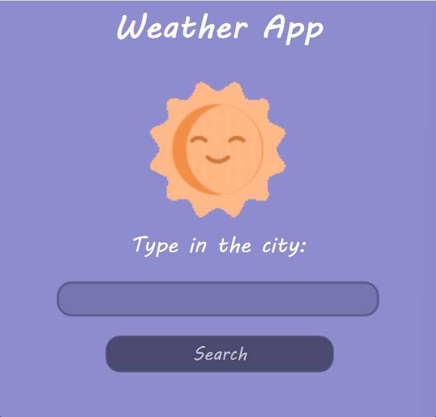
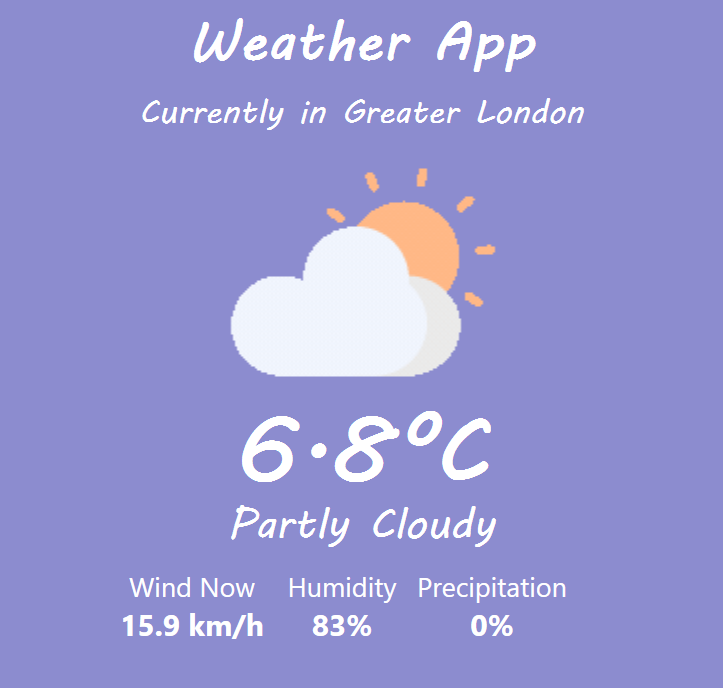

# Weather Application 🌤️

A desktop weather application built with C# and WPF that provides real-time weather information for any city in the world.

## Features

-  Search for any city worldwide
-  Real-time temperature display
-  Day/night detection with appropriate icons
- Wind speed information
- Humidity levels
-  Precipitation probability
-  Animated weather icons (sun, moon, clouds, rain, snow)
-  Clean, modern UI with custom styling

## Technologies Used

- **C#** - Programming language
- **WPF (Windows Presentation Foundation)** - UI framework
- **XAML** - UI markup
- **Open-Meteo API** - Weather data
- **Nominatim API** - Geocoding (city search)
- **WpfAnimatedGif** - Animated GIF support
- **HttpClient** - API requests
- **JSON parsing** - Data handling

## Screenshots

<p align="center">
  
  
</p>


## How to Run

# 🌤 Weather App (WPF)

A C# WPF weather application that fetches real-time weather data using the Open-Meteo API.

##  How to Run

1. Clone the repository:

```bash
git clone https://github.com/itsHanna27/WeatherApp.git
```

2. Open `WeatherApp.sln` in Visual Studio  
3. Run the project


## API Usage

This application uses two free APIs:
- **Open-Meteo API** - Provides weather data (no API key required)
- **Nominatim API** - OpenStreetMap geocoding service (no API key required)

## Project Structure
```
WeatherApplication/
├── MainWindow.xaml          
├── MainWindow.xaml.cs      
├── WeatherPage.xaml        
├── WeatherPage.xaml.cs     
└── Assets/                 
    ├── sun.gif
    ├── moon.gif
    ├── cloudy.gif
    ├── rain.gif
    └── snow.gif
```

## Features in Detail

### Search Functionality
- Type any city name and press Enter or click Search
- Supports cities worldwide
- Error handling for invalid cities

### Weather Display
- Temperature in Celsius
- Current weather condition
- Animated weather icons that change based on:
  - Weather type (clear, cloudy, rain, snow)
  - Time of day (sun during day, moon at night)
- Wind speed (km/h)
- Humidity percentage
- Precipitation probability

